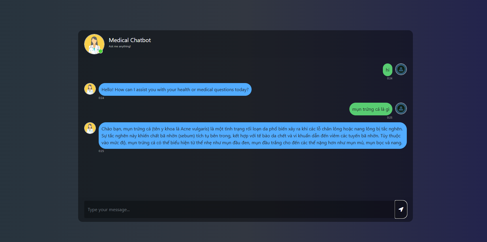

# Medical Chatbot | Trợ Lý Y Khoa AI

Một ứng dụng chatbot y khoa thông minh hỗ trợ cả tiếng Việt và tiếng Anh, được xây dựng bằng LangChain, Google Gemini API, và Pinecone Vector Database.

**An intelligent medical chatbot application supporting both Vietnamese and English, built with LangChain, Google Gemini API, and Pinecone Vector Database.**

---

## 📋 Mục Lục (Table of Contents)

- [Tính Năng (Features)](#-tính-năng--features)
- [Yêu Cầu (Requirements)](#-yêu-cầu--requirements)
- [Cài Đặt (Installation)](#-cài-đặt--installation)
- [Cấu Hình (Configuration)](#-cấu-hình--configuration)
- [Cách Sử Dụng (Usage)](#-cách-sử-dụng--usage)
- [Cấu Trúc Dự Án (Project Structure)](#-cấu-trúc-dự-án--project-structure)
- [API Endpoints](#-api-endpoints)
- [Công Nghệ Sử Dụng (Technologies)](#-công-nghệ-sử-dụng--technologies)
- [Tác Giả (Author)](#-tác-giả--author)

---

## 🎯 Tính Năng (Features)

✅ **Hỗ trợ đa ngôn ngữ** - Tự động nhận diện tiếng Việt hoặc tiếng Anh và phản hồi cùng ngôn ngữ  
✅ **Multi-language support** - Auto-detect Vietnamese or English and respond accordingly

✅ **Truy vấn nâng cao** - Mở rộng và xếp hạng lại tài liệu để có câu trả lời chính xác hơn  
✅ **Advanced Retrieval** - Query expansion and document reranking for accurate answers

✅ **Cơ sở dữ liệu PDF** - Xử lý và tìm kiếm qua các tài liệu PDF y khoa  
✅ **PDF Knowledge Base** - Process and search through medical PDF documents

✅ **Giao diện web** - Ứng dụng Flask với interface hiện đại và dễ sử dụng  
✅ **Web Interface** - Flask-based web application with modern UI

✅ **Đặc biệt an toàn** - Không bịa đặt kiến thức y khoa, chỉ dựa trên tài liệu được cung cấp  
✅ **Safety First** - Never fabricates medical information, relies only on provided documents

---

## � Demo



---

## �📦 Yêu Cầu (Requirements)

- Python 3.8+
- Conda (khuyến nghị) hoặc pip
- API keys:
  - **Google Gemini API key** (https://aistudio.google.com/)
  - **Pinecone API key** (https://www.pinecone.io/)
- Modern web browser (Chrome, Firefox, Edge, Safari)

---

## 🚀 Cài Đặt (Installation)

### 1. Clone repository hoặc download project

```bash
cd b:\Project\-Chatbot-Medical
```

### 2. Tạo virtual environment

**Với Conda:**
```bash
conda create -n med_chatbot python=3.10
conda activate med_chatbot
```

**Hoặc với venv:**
```bash
python -m venv venv
venv\Scripts\activate
```

### 3. Cài đặt dependencies

```bash
pip install -r requirements.txt
```

---

## ⚙️ Cấu Hình (Configuration)

### 1. Tạo file `.env` trong root directory

```bash
touch .env
```

### 2. Thêm API keys vào `.env`

```env
PINECONE_API_KEY=your_pinecone_api_key_here
GEMINI_API_KEY=your_google_gemini_api_key_here
```

### 3. Chuẩn bị dữ liệu (nếu cần)

Đặt các file PDF y khoa vào folder `data/`:

```bash
data/
├── medical_document_1.pdf
├── medical_document_2.pdf
└── ...
```

### 4. Xây dựng Pinecone index (lần đầu)

```bash
python store_index.py
```

---

## 💻 Cách Sử Dụng (Usage)

### Khởi động ứng dụng

```bash
python app.py
```

Mở trình duyệt và truy cập: **http://localhost:5000**

### Giao diện chatbot

1. Nhập câu hỏi y khoa của bạn (tiếng Việt hoặc tiếng Anh)
2. Nhấn Enter hoặc nút Send
3. Chatbot sẽ:
   - Mở rộng truy vấn của bạn
   - Tìm kiếm tài liệu liên quan từ Pinecone
   - Xếp hạng lại kết quả
   - Tạo ra câu trả lời từ Google Gemini

---

## 📁 Cấu Trúc Dự Án (Project Structure)

```
-Chatbot-Medical/
├── app.py                           # Flask main application
├── store_index.py                   # Script tạo/cập nhật Pinecone index
├── requirements.txt                 # Dependencies
├── setup.py                         # Package setup
├── README.md                        # Documentation (file này)
│
├── src/
│   ├── __init__.py                  # Package initialization
│   ├── prompt.py                    # LLM system prompt
│   └── helper.py                    # Utility functions (PDF loading, embeddings, etc.)
│
├── data/                            # Thư mục chứa PDF y khoa
│   └── (your PDF files here)
│
├── static/
│   └── style.css                    # CSS styling
│
├── templates/
│   └── chat.html                    # Chat interface HTML
│
└── research/
    └── trials.ipynb                 # Research notebook
```

---

## 🔌 API Endpoints

### GET `/`
Hiển thị giao diện chatbot chính.

### POST `/chat`
Gửi câu hỏi và nhận câu trả lời.

**Request:**
```json
{
  "question": "Bệnh tiểu đường là gì?"
}
```

**Response:**
```json
{
  "answer": "Tiểu đường là một bệnh mãn tính...",
  "sources": ["document_name.pdf"]
}
```

---

## 🛠️ Công Nghệ Sử Dụng (Technologies)

| Công Nghệ | Vai Trò |
|-----------|--------|
| **Flask** | Web framework |
| **LangChain** | LLM orchestration & RAG |
| **Google Gemini** | Large Language Model |
| **Pinecone** | Vector Database |
| **HuggingFace** | Embeddings model |
| **Sentence-Transformers** | Semantic similarity |
| **PyPDF** | PDF document processing |
| **Python-dotenv** | Environment variables management |

---

## 🔍 Quy Trình Hoạt Động (How It Works)

```
User Input (Vietnamese/English)
        ↓
Language Detection & Query Expansion
        ↓
Embedding Generation (HuggingFace)
        ↓
Vector Similarity Search (Pinecone)
        ↓
Document Reranking
        ↓
Context Assembly
        ↓
LLM Response (Google Gemini)
        ↓
Language-matched Output
```

---

## 📝 Ghi Chú Quan Trọng (Important Notes)

⚠️ **Y Tế:**
- Chatbot này là công cụ hỗ trợ, KHÔNG PHẢI sự thay thế cho tư vấn bác sĩ
- Luôn tư vấn chuyên gia y tế cho các quyết định y tế quan trọng

⚠️ **Hiệu Suất:**
- Chất lượng câu trả lời phụ thuộc vào chất lượng tài liệu trong knowledge base
- Cập nhật định kỳ knowledge base để có thông tin y tế mới nhất

---

## 👤 Tác Giả (Author)

**ThTam**

Dự án này được phát triển như một ứng dụng RAG (Retrieval-Augmented Generation).

---

## 
Nếu gặp vấn đề, vui lòng:
1. Kiểm tra file `.env` có đầy đủ API keys
2. Xác minh Pinecone index được khởi tạo thành công
3. Kiểm tra logs trong terminal

---

**Last Updated:** June 2026
